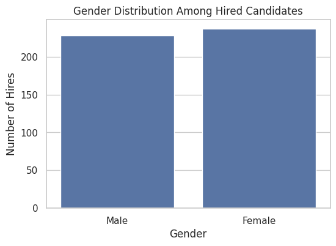
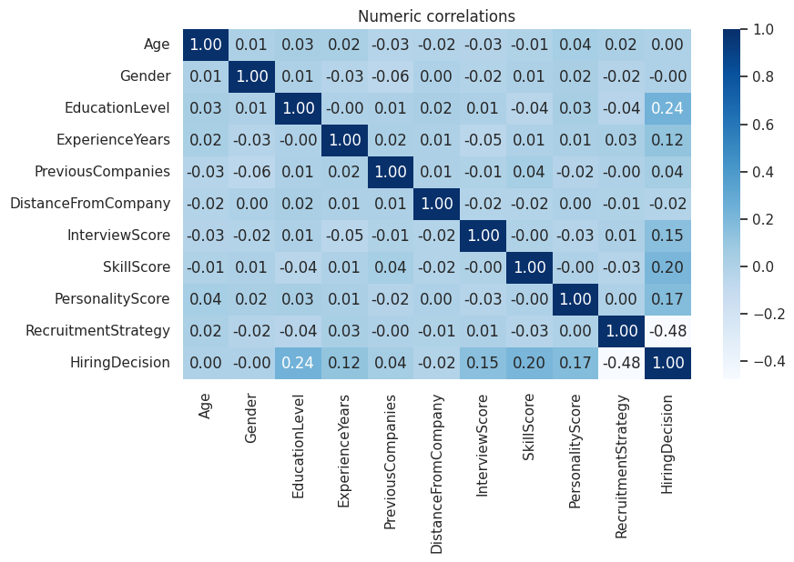
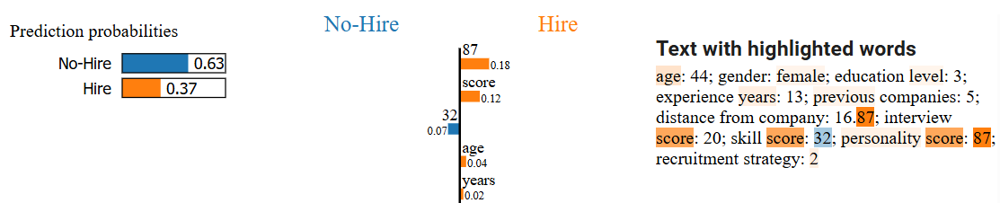
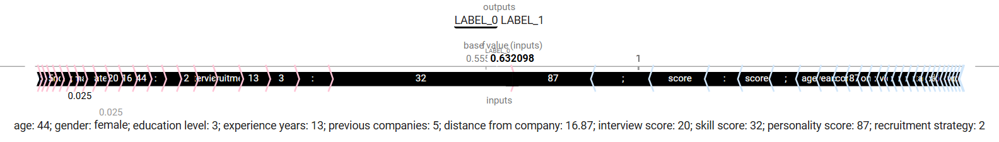
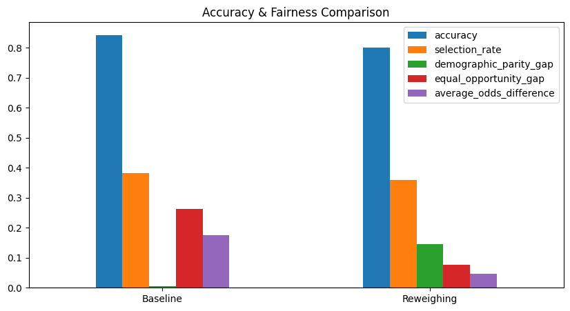

# Bias Detection & Explainability in Text-Based Hiring Models  
48-Hour Technical Challenge — Track CIS-2025-19

## 1  Overview
This repo hosts the code, data-processing pipeline, and analysis used to

* fine-tune **DistilBERT** on résumé-style text,
* audit group-fairness metrics,
* generate local explanations with **LIME** and **SHAP**, and
* apply **re-weighing** as a bias-mitigation baseline.

The two-page PDF report is in [Fairness_Report_Rasmy.pdf](Fairness_Report_Rasmy.pdf).

---

## 2  Dataset

The original CSV contains **1 500** rows.  
Each row is serialised into a single text string, e.g.

```

age: 41; gender: female; education level: 4; experience years: 0;
previous companies: 1; distance from company: 34.43; interview score: 19;
skill score: 56; personality score: 98; recruitment strategy: 2

````

| Split | Size | Gender ratio (F / M) | Note                                |
|-------|-----:|---------------------:|-------------------------------------|
| Train | 80 % | **60 / 40**          | intentional imbalance |
| Test  | 20 % | 6 / 94               | stress-test generalisation |


When creating the training set we injected a \underline{representation imbalance}:  
60 \% \textit{female} vs.\ 40 \% \textit{male}.  
The test set remains naturally imbalanced (94 \% male).  
To quantify adverse impact we enforce the \textit{four-fifths rule} with tolerance $\tau=0.7$:
$$
\frac{\Pr(\text{Hire}=1 \mid X=\text{Female})}
     {\Pr(\text{Hire}=1 \mid X=\text{Male})}
\;\le\; \tau = 0.8
$$  

---

## 3  Exploratory Data Analysis

**Hire-rate parity.** Figure 1 shows that raw hire counts for males and females are nearly identical.



**Feature correlations.** Figure 2 confirms that both Age and Gender have **0** Pearson correlation with the label `HiringDecision`.



---

## 4  Model Training
Base model: `distilbert-base-uncased` (3 epochs, batch 8).  
Checkpoint: `Rasmy/results`.

| metric | value |
|--------|------:|
| accuracy | 0.843 |
| F1       | 0.841 |
| precision| 0.850 |
| recall   | 0.843 |

---

## 5  Fairness Analysis

Group metrics (Fairlearn) on the held-out test set:

| Metric | Formula | Baseline value |
|--------|---------|---------------:|
| Demographic-Parity Gap | $$\| P(ŷ=1\|S=0) − P(ŷ=1\|S=1) \|$$ | 0.006 |
| Equal-Opportunity Gap  | $$\| TPR₀ − TPR₁ \|$$ | 0.263 |
| Average-Odds Diff      | $$\frac{1}{2}(\|TPR₀−TPR₁\| + \|FPR₀−FPR₁\|)$$ | 0.175 |

---

## 6  Explainability

Four test cases show negligible gender attribution in both LIME and SHAP.  
**Case #5** (Figures 4 & 5) exhibits a mild positive weight for the token “female”, yet score-related tokens dominate.





---

## 7  Bias Mitigation — Re-Weighing

Weight formula: \( w(y,s)=\frac{P(Y=y)P(S=s)}{P(Y=y,S=s)} \)

| model      | accuracy | demo-parity | equal-opp | avg-odds |
|------------|---------:|------------:|----------:|---------:|
| baseline   | 0.843 | 0.006 | 0.263 | 0.175 |
| re-weigh   | 0.800 | 0.147 | **0.077** | **0.047** |

Re-weighing reduces error-based gaps by ~70 % at a 4-pp accuracy cost and increases the parity gap.

Figure 3 visualises the trade-off between accuracy and fairness metrics.

